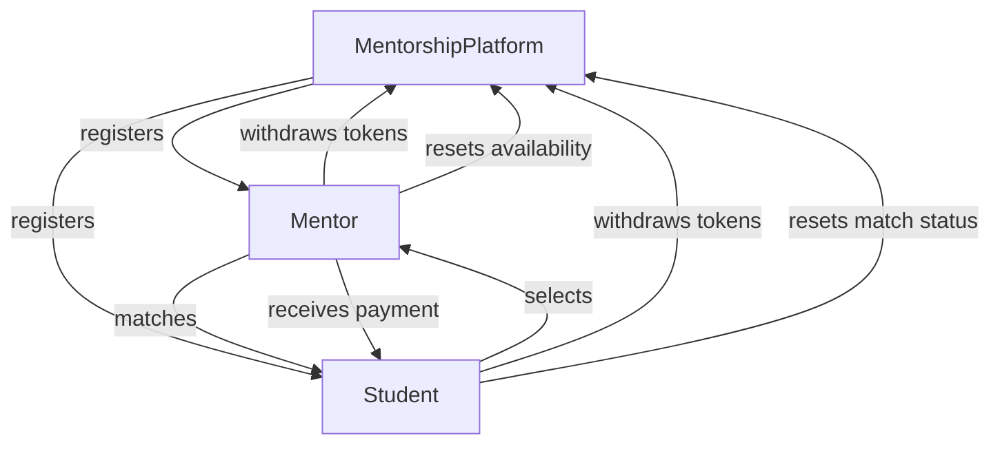

Here is a README file for your `MentorshipPlatform` smart contract, structured with vision, features, a diagram, and deployment details.

```markdown
# MentorshipPlatform

## Vision

The MentorshipPlatform is designed to create a decentralized and transparent environment where mentors can offer their expertise to students seeking guidance. By leveraging the Ethereum blockchain, the platform ensures trust, security, and fair compensation for mentors while allowing students to find mentors that match their learning requirements.

## Features

- **Mentor and Student Registration**: 
  - Mentors can register with their skills, and students can register with their learning requirements.
  - Unregistered users are prevented from performing actions meant for registered mentors or students.

- **Skill-Based Matching**: 
  - Students can search for mentors based on specific skill requirements.
  - The platform matches students with available mentors who possess the required skills.

- **Mentorship Selection and Transaction**: 
  - Students can select a mentor from the list of matched mentors.
  - Upon selection, a transaction occurs where the student pays a mentorship fee to the mentor.

- **Rewards and Withdrawals**: 
  - Mentors and students can withdraw their earned tokens.
  - The platform includes an event system to notify users of important actions like mentor registration, student registration, matching, and transactions.

- **State Reset Functions**: 
  - Mentors can reset their availability status, and students can reset their match status, allowing them to participate in new mentorship cycles.

## Smart Contract Diagram



## Deployment

### Prerequisites

- **Solidity Compiler**: Version `0.8.0` or higher.
- **Ethereum Development Environment**: Truffle, Hardhat, or Remix.
- **Test Network**: Ganache, Rinkeby, or any Ethereum testnet.

### Steps

1. **Clone the Repository**: 
    ```bash
    git clone https://github.com/yourusername/MentorshipPlatform.git
    cd MentorshipPlatform
    ```

2. **Compile the Smart Contract**:
    ```bash
    solc --optimize --bin --abi MentorshipPlatform.sol -o build
    ```

3. **Deploy to Test Network**:
    - Using Truffle:
        ```bash
        truffle migrate --network <network_name>
        ```
    - Using Hardhat:
        ```bash
        npx hardhat run scripts/deploy.js --network <network_name>
        ```

4. **Interact with the Contract**:
    - You can interact with the deployed contract using the Ethereum development environment or directly via a frontend dApp.

5. **Frontend Integration**:
    - Use a web3 provider like MetaMask to interact with the contract on a web application.
    - Connect to the contract using the ABI and the deployed contract address.

### Example Deployment Script

Here is an example deployment script for Hardhat:

```javascript
async function main() {
    const MentorshipPlatform = await ethers.getContractFactory("MentorshipPlatform");
    const mentorshipPlatform = await MentorshipPlatform.deploy();
    console.log("MentorshipPlatform deployed to:", mentorshipPlatform.address);
}

main()
    .then(() => process.exit(0))
    .catch((error) => {
        console.error(error);
        process.exit(1);
    });
```

## License

This project is licensed under the MIT License. See the [LICENSE](LICENSE) file for details.
```

You can create a file named `README.md` and place the above content in it. This will give users a clear understanding of your project, its vision, features, and how to deploy and interact with the smart contract.
